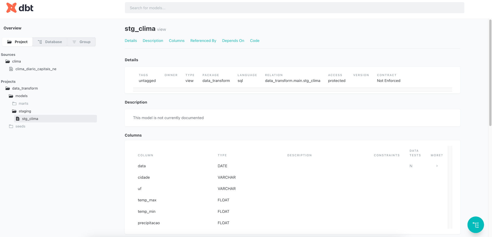
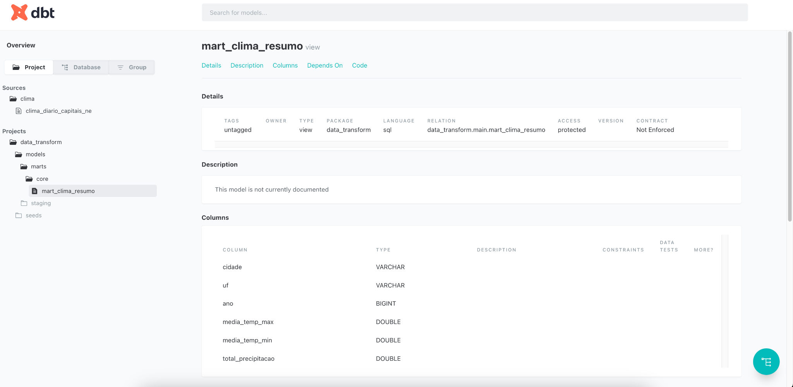

# Climate Data Pipeline — Weather in Northeast Brazil Capitals (2020–2024)

This project uses **dbt (data build tool)** with **DuckDB** to transform historical weather data obtained from the [Open-Meteo API](https://open-meteo.com/). The dataset contains daily information on maximum and minimum temperatures and precipitation for the **9 capital cities of the Northeast Region of Brazil**, from **2020 to 2024**.

## Objective

To demonstrate, using dbt best practices:

* The ingestion of public data via API (as CSV seed)
* The use of `staging` and `mart` models
* The generation of an annual climate summary per city

---

## Project Flow (Pipeline)

```text
[Open-Meteo API] 
     │
     ▼
[Python Script - fetches and generates CSV in /seeds]
     │
     ▼
[dbt seed]
     │
     ▼
[Model: stg_clima.sql → cleaning and typing]
     │
     ▼
[Model: mart_clima_resumo.sql → aggregations by city and year]
     │
     ▼
[Documentation and tests with schema.yml]
```

---

## Project Structure

```
data_transform/
├── models/
│   ├── staging/
│   │   └── stg_clima.sql           # Cleans and types seed data
│   ├── marts/
│   │   └── core/
│   │       └── mart_clima_resumo.sql  # Aggregations by city and year
│   └── schema.yml                  # Tests and documentation
├── seeds/
│   └── clima_diario_capitais_ne.csv  # Original weather dataset
├── dbt_project.yml
├── generate_open_meteo_seed.py       # Script to fetch weather data
```

---

## Taskipy Commands

To automate execution steps, this project uses **Taskipy**. Here are the commands available:

```bash
poetry run task dbt_seed
```

> Loads the CSV file located in the `seeds/` folder into DuckDB. This is the starting point of the dbt transformation process.

```bash
poetry run task dbt_run
```

> Executes the dbt models. It will process the seed via the `stg_clima` model and generate the summarized view `mart_clima_resumo`.

```bash
poetry run task dbt_docs
```

> Builds and serves the dbt documentation locally at `http://localhost:8080`. You can browse model metadata, column types, and dependencies.

```bash
poetry run task dbt_all
```

> Runs all the above steps in sequence: loads seed, runs models, and starts the documentation site.

```bash
poetry run task git_stage
poetry run task git_commit
poetry run task git_push
poetry run task git_all
```

> These commands allow versioning your project easily: stage changes, commit with a message, and push to GitHub.

---

## Documentation Snapshots

The following pages show how dbt interprets and documents the models automatically:

### `stg_clima` model

* Performs data normalization: dates, floats, lowercase city names.
* Columns include: `data`, `cidade`, `uf`, `temp_max`, `temp_min`, `precipitacao`.

### `mart_clima_resumo` model

* Aggregates data yearly per city and state.
* Columns include: `cidade`, `uf`, `ano`, `media_temp_max`, `media_temp_min`, `total_precipitacao`.

These views can be explored via the auto-generated dbt documentation site after running `dbt docs serve`.

---

## How to Run

```bash
# 1. Install dependencies (with Poetry)
poetry install

# 2. Generate seed (optional if already exists)
python generate_open_meteo_seed.py

# 3. Execute the pipeline
poetry run task dbt_all
```

> Make sure your `~/.dbt/profiles.yml` is configured for DuckDB and points to the correct project database.

---

## Technologies Used

* **dbt-duckdb**: local SQL transformation with lightweight storage
* **Open-Meteo API**: historical weather data via HTTP
* **DuckDB**: columnar analytical database
* **Poetry + Taskipy**: automation and dependency management

---

## Author

Developed by Letícia Gomes C. S.

This is an educational project designed to demonstrate how to build analytical pipelines using public data and dbt best practices.

---

## Pages Referenced

* **Staging Model (`stg_clima`)**
  

* **Mart Model (`mart_clima_resumo`)**
  

> These screenshots represent the dbt auto-documentation UI. You can generate your own by running `poetry run task dbt_docs`.
